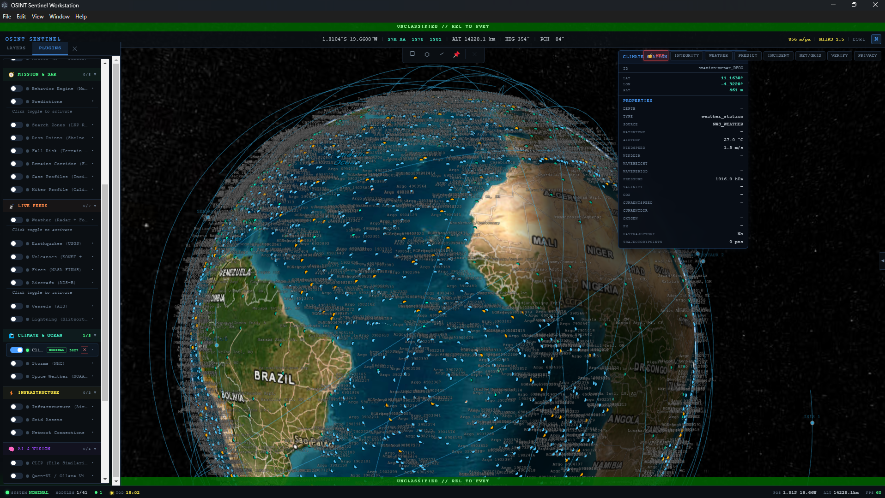

# OSINT Sentinel Workstation

An offline-first geospatial intelligence cockpit for Windows and macOS.
A hardware-accelerated 3D Earth at the center — multispectral satellite
analysis, terrain compute, live global feeds, local AI, and mission-grade
search-and-rescue tooling, in a single window.

This repository is the **public home** of the project: downloads,
documentation, issue tracking, and community. Development happens in a
private repository; releases and docs are published here.

---

## Download

Grab the latest build from
[**Releases**](https://github.com/harrythebear18-lab/Osint-Sentinal-Workstation-OP/releases):

| File | What it is |
|------|------------|
| `OSINT Sentinel Workstation Setup x.y.z.exe` | Windows installer (x64 + arm64) |
| `OSINT Sentinel Workstation x.y.z.exe` | Windows portable — no install, run anywhere |

**Requirements:** Windows 10/11, a GPU with up-to-date drivers, ~4 GB
free disk. An internet connection is needed for live feeds and fresh
imagery — everything already cached keeps working offline.

## What it does

- **A real analysis globe** — 3D Earth with high-resolution base imagery,
  historic imagery releases going back to 2014, terrain-aware overlays.
- **Multispectral satellite analysis** — Sentinel-2 ingestion with
  vegetation, water, and burn indices rendered on the globe.
- **Terrain intelligence** — elevation, slope, hillshade, runoff and
  flood-path modeling, watershed divides, anomaly detection.
- **Live global picture** — satellites, aircraft, vessels, earthquakes,
  wildfires, lightning, storms, volcanic activity, space weather,
  road traffic.
- **Mission & SAR tooling** — search zones, last-known-point rings,
  behavior profiles, terrain-aware routing, GeoJSON/KML/KMZ export.
- **Local AI** — scene-aware assistant and image search running on your
  own machine. Nothing leaves unless you allow it.
- **Hardware-accelerated compute** — heavy analysis dispatches to your
  GPU and CPU vector units automatically, with graceful fallback.
- **Offline-first** — imagery and terrain caches keep working with no
  network; caches are bounded so they can't eat your disk.
- **Ops sessions** — host a shared scene for other workstations on your
  network. Participants keep their own cameras; shared state syncs.
  Joining uses a session PIN — persistent device pairing is a separate,
  explicit approval.
- **Privacy-first** — staged security model controls what network and
  location data is exposed. No telemetry unless you enable it.

## Editions

The workstation is free to use as a base - modules/plugins are subject to re-evaluation after the first 12 months of existence as of - 22 September 2026 - 
| Tier | What you get |
|------|--------------|
| **Free** | The full current feature set, permanently |
| **Trial** | 14 days of everything including premium modules — automatic on install, refreshes with each release |
| **Pro / Enterprise** | License key unlocks premium modules as they ship |

The app never locks you out — if a trial ends, you keep the free tier.
Keys are activated in-app under **LICENSE** in the toolbar.

## Get help / get involved

- [Report a bug](../../issues/new?template=bug_report.yml)
- [Request a feature](../../issues/new?template=feature_request.yml)
- [Ask a question](../../issues/new?template=question.yml)
- [GitHub Discussions](../../discussions) — ideas, Q&A, show-and-tell
- [Discord](https://discord.gg/visentrix)

See [SUPPORT.md](SUPPORT.md) for details. To report a security
vulnerability privately, see [SECURITY.md](SECURITY.md).

## License

Proprietary — see [LICENSE](LICENSE). The Workstation uses a layered
licensing model: the cockpit surface is designed for plugin-ecosystem
growth, while the Core Engine remains protected. A plugin SDK and public
API surface are planned — watch this repo.

---

© 2026 Visentrix. All rights reserved.
